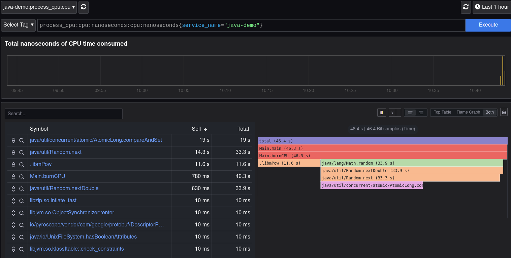

# 📘 Observability POC — CPU Flamegraphs for Java in Kubernetes (Pyroscope)

**UPDATE:** [POC extended to demonstrate CPU regression detection via differential flamegraphs here](./README_DIFFERENTIAL.md).

**Note:** This POC currently demonstrates CPU profiling using the **Pyroscope Java agent**.  
eBPF DaemonSet profiling is included in the repo for later adoption in hardened clusters and production-grade setups. Both paths are supported in design. 

It is designed to model a **real-world banking production environment targeting RHEL9** while being fully runnable on **Ubuntu or any Linux laptop**.



## 🔧 Features

- Pyroscope-based CPU flamegraphs for Java workloads
- Kubernetes deployment automation
- Lightweight sample Java workload
- Pyroscope UI for visualization
- Works without code changes to the Java app

### Optional/Advanced (included for future or hardened clusters)
- eBPF-powered continuous profiling (no JVM agent required)
- JVM JIT + Native stack tracing
- Kubernetes-aware container attribution
- Production-oriented RHEL9 compatibility path 

## 📂 Repository Structure

```
observability-poc/
├── k8s/
│   ├── pyroscope-daemonset.yaml
│   ├── pyroscope-server.yaml
│   └── java-demo-deployment.yaml
├── java-demo/
│   ├── Main.java
│   ├── Dockerfile
│   └── build.sh
├── scripts/
│   ├── reset_demo.sh
│   ├── port-forward-pyroscope.sh
│   └── verify-ebpf.sh
└── README.md

```

## 🚀 Prerequisites

### Local Machine
- Linux laptop (Ubuntu recommended)
- Docker or Podman
- Kubernetes (Kind, Minikube, or MicroK8s)
- `kubectl` installed
- Kernel with BPF + BTF support (Ubuntu 22.04+ OK)

### To verify eBPF support
```
./scripts/verify-ebpf.sh
```

## Reset + Rebuild + Deploy (automated)

> This creates a kind cluster if one doesn't already exist, builds the Java image,
> loads it into kind, deploys Pyroscope and the java-demo workload, and port-forwards
> the UI automatically.

```bash
./scripts/reset_demo.sh
```

When the script completes, open Pyroscope:

```
http://localhost:4040
```

---

## 🔥 Generate CPU Load

You should start seeing `java-demo` flamegraphs within ~5–10 seconds.

Profiling output will show functions such as:

- `Main.burnCPU()`
- `java.util.Random.next*`
- atomic operations (`compareAndSet`)
- mathematical calls (`libmPow`, etc.)

---

## Manual Commands (if needed)

### Build & load image to kind manually

```bash
docker build -t java-demo:latest java-demo
kind load docker-image java-demo:latest --name observability-demo
```

### Apply Kubernetes manifests

```bash
kubectl apply -f k8s/pyroscope-server.yaml -n observability-demo
kubectl apply -f k8s/java-demo-deployment.yaml -n observability-demo
```

### Port-forward UI manually

```bash
kubectl port-forward svc/pyroscope 4040:4040 -n observability-demo
```

## 🌐 Access Pyroscope UI

```
./scripts/port-forward-pyroscope.sh
```

Go to: http://localhost:4040

## 🔥 View Flamegraphs

Pyroscope will automatically show:

- CPU Flamegraph  
- Time-Diff Flamegraph  
- Table View  

## 🛠 RHEL9 Compatibility Notes

- Ensure BTF available  
- SELinux considerations  
- Privileged DaemonSet requirements  

## 📊 Comparison With Other Profiling Methods

(TODO eBPF vs JFR vs async-profiler comparison table)

## 🏦 Stakeholder Summary

### Benefits
- Zero instrumentation  
- Low overhead  
- Full JVM/native profiling  
- Works with hardened clusters  

### Risks
- Privileged DaemonSet approval  
- SELinux blocking  
- Kernel mismatches  

## 🎯 Summary

A Java CPU observability POC using Pyroscope, with both **Java agent mode (default demo)** 
and **eBPF DaemonSet mode (designed for RHEL9 production environments)**.

## 📦 External Dependencies

| Component | Required for Current POC (Java Agent) | Required for eBPF Mode | Notes |
|---|:---:|:---:|---|
| Kubernetes Cluster (Kind/Minikube/OpenShift/etc.) | ✔ | ✔ | Any CNCF-distribution works |
| Docker/Podman | ✔ | ✔ | Used to build images |
| Pyroscope Server Container Image | ✔ | ✔ | Needs to be mirrored internally if offline |
| Pyroscope Java Agent JAR | ✔ | ❌ | Not required if eBPF is used instead |
| JDK Base Image (Temurin/RedHat UBI JDK) | ✔ | ✔ | Must include JFR/JSTACK support for JFR later |
| Container Registry (Internal or External) | ✔ | ✔ | For `java-demo:latest` and Pyroscope image |
| Privileged DaemonSet Permissions | ❌ | ✔ | Required only for eBPF kernel profiling |
| Kernel with eBPF/BTF Enabled | ❌ | ✔ | RHEL9 compatible; verify using `verify-ebpf.sh` |
| SELinux Permissive or Policy Adjustment | ❌ | ✔ | Required for BPF maps in hardened clusters |

**Summary:** *Java agent mode runs without privileged kernel access — easiest for locked-down enterprise environments.*  

### 🔐 Minimum Items to Import into Corporate Environment

Only required for **Java Agent Mode** (default POC):

- [ ] `eclipse-temurin:17-jdk` base container image *(or RHEL UBI JDK equivalent)*
- [ ] Pyroscope server container image
- [ ] Pyroscope Java agent JAR
- [ ] A Kubernetes namespace + ability to deploy non-privileged pods
- [ ] Internal container registry for pushing `java-demo` image

_Not required initially:_  
Privileged DaemonSet, eBPF kernel permissions, SELinux policy changes.

## Pyroscope Profiling Approach Comparison

| Feature | Java Agent Mode (Current Demo) | eBPF Mode (Future/Hardened Clusters) |
|---|---|---|
| Requires code change | ❌ No | ❌ No |
| Requires JVM flag change | ✔ Yes (`-javaagent`) | ❌ No |
| Requires image rebuild | ✔ Yes | ❌ No |
| Requires privileged pods | ❌ No | ✔ Yes |
| Works without kernel access | ✔ Yes | ❌ No |
| Captures userland Java stacks | ✔ Yes | ✔ Yes |
| Captures native/JIT stacks | ⚠ Partial | ✔ Full |
| Observes all workloads cluster-wide | ❌ Per-pod | ✔ Yes |
| Deployment difficulty | 🟢 Easy | 🔴 High (security approval) |
| Corporate approval likelihood | 🟢 High | 🔴 Low/Medium |
| Production suitability | Good | Excellent (when allowed) |

**Summary:**  
- **Java agent → best for dev/test/POCs/internal clusters**  
- **eBPF → best for production fleet-wide observability where approved**

# Pyroscope Java Agent Profiling Engines

This document describes how to choose between the two profiling engines used by the
Pyroscope Java agent, and how to configure them via environment variables.

## Profiling engine: async-profiler vs JFR (Pyroscope Java agent)

The Pyroscope Java agent can use two different profiling engines:

- **Default:** [`async-profiler`](https://github.com/jvm-profiling-tools/async-profiler)
- **Optional:** JVM’s built-in **Java Flight Recorder (JFR)**

You choose the engine via the `PYROSCOPE_PROFILER_TYPE` environment variable.


## Default (async-profiler)

On Linux (RHEL 7/8/9, etc.) the agent uses **async-profiler** by default – you don’t need
to set anything special:

```bash
export PYROSCOPE_APPLICATION_NAME=java-demo
export PYROSCOPE_SERVER_ADDRESS=http://pyroscope:4040

java -javaagent:/opt/pyroscope/pyroscope.jar      -jar app.jar
```

**Characteristics:**

- Low-overhead sampling profiler
- Good visibility into **Java, native, and kernel** frames
- Supports CPU, allocation, and lock profiling
- Great for **deep performance investigations** on Linux

This is usually the best option for Linux servers with `perf_events` enabled.


## JFR-based profiling

You can tell the Pyroscope agent to use JVM’s built-in **JFR** instead:

```bash
export PYROSCOPE_APPLICATION_NAME=java-demo
export PYROSCOPE_SERVER_ADDRESS=http://pyroscope:4040

# Use JFR instead of async-profiler:
export PYROSCOPE_PROFILER_TYPE=JFR

# (Recommended) send data to Pyroscope in JFR format:
export PYROSCOPE_FORMAT=jfr

java -javaagent:/opt/pyroscope/pyroscope.jar      -jar app.jar
```

**Characteristics:**

- Uses the **JFR engine built into the JVM**
- Designed for **always-on, low-overhead** production profiling
- Works in environments where `perf_events` / eBPF are restricted
- Aligns nicely if you already use **JFR + Mission Control**


## When to use which?

| Engine          | Use when…                                                                 |
|-----------------|---------------------------------------------------------------------------|
| async-profiler  | Linux (RHEL 8/9 etc.), you want maximum detail incl. native/kernel code. |
| JFR             | Windows or locked-down Linux, or when you prefer sticking to pure JFR.   |

Both engines feed data into the same Pyroscope backend, so you can switch between them
just by changing environment variables.
